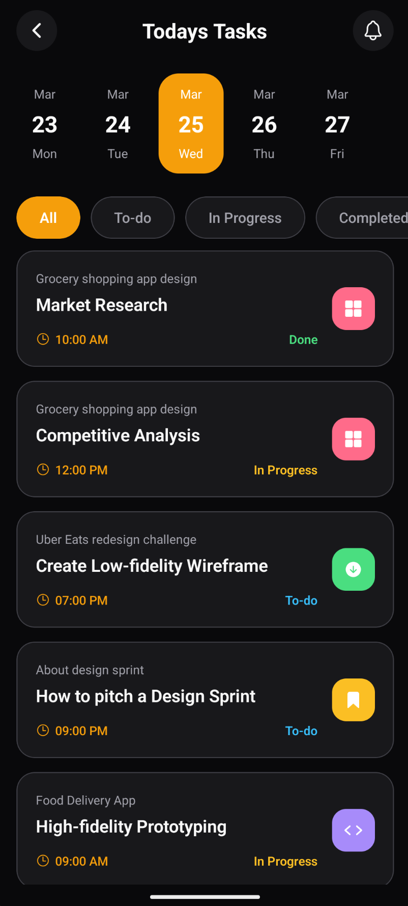

# Task Manager App (UI Practice Project)

A modern Task Manager app UI built with **React Native** and **Expo** for learning and practice.

> This is **not a complete production app**.
> It focuses mostly on UI and component structure, with only some features functional.

<p align="center">
  
</p>

## Purpose

This project was created to:

- Practice React Native UI building
- Learn Expo Router (file-based routing)
- Improve TypeScript and reusable component patterns
- Explore mobile layout and styling techniques

## Current Features (Partial)

- Task list UI with category styling
- Status filter tabs UI (`All`, `To-do`, `In Progress`, `Completed`)
- Date selector UI
- Task card layout
- Basic navigation to task details screen

## Tech Stack

- **Framework**: [React Native](https://reactnative.dev/)
- **Toolset**: [Expo](https://expo.dev/) + Expo Router
- **Language**: TypeScript
- **Styling**: React Native `StyleSheet` + SafeAreaContext

## 📁 Project Structure

```text
├── assets/                 # App icons and images
├── components/             # Reusable UI components
│   ├── DateSelector.tsx
│   ├── FilterTabs.tsx
│   ├── Header.tsx
│   └── TaskCard.tsx
├── constants/              # Theme and mock data
│   ├── Colors.ts
│   └── tasks.ts
└── src/app/                # Expo Router screens
    ├── _layout.tsx
    ├── index.tsx
    └── task/
        └── [id].tsx
```

## Getting Started

### Prerequisites

- [Node.js](https://nodejs.org/)
- npm, yarn, or pnpm
- Expo Go app or iOS/Android simulator

### Run Locally

1. Move to the project directory:

   ```bash
   cd first_native_app
   ```

2. Install dependencies:

   ```bash
   npm install
   ```

3. Start the app:

   ```bash
   npx expo start
   ```

4. Open it:
   - Press `i` for iOS Simulator
   - Press `a` for Android Emulator
   - Or scan the QR code using Expo Go

## Note

This project is a learning build made for practice, so some features are intentionally incomplete.
